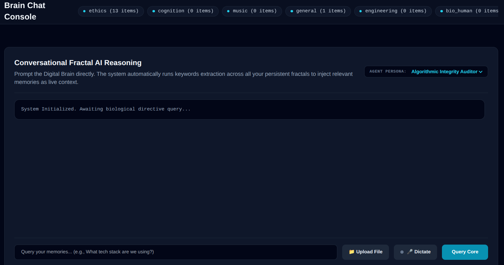
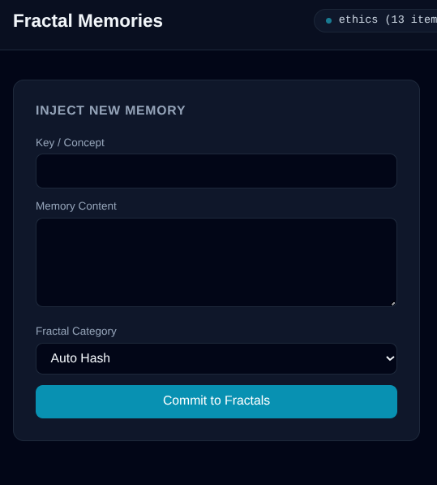
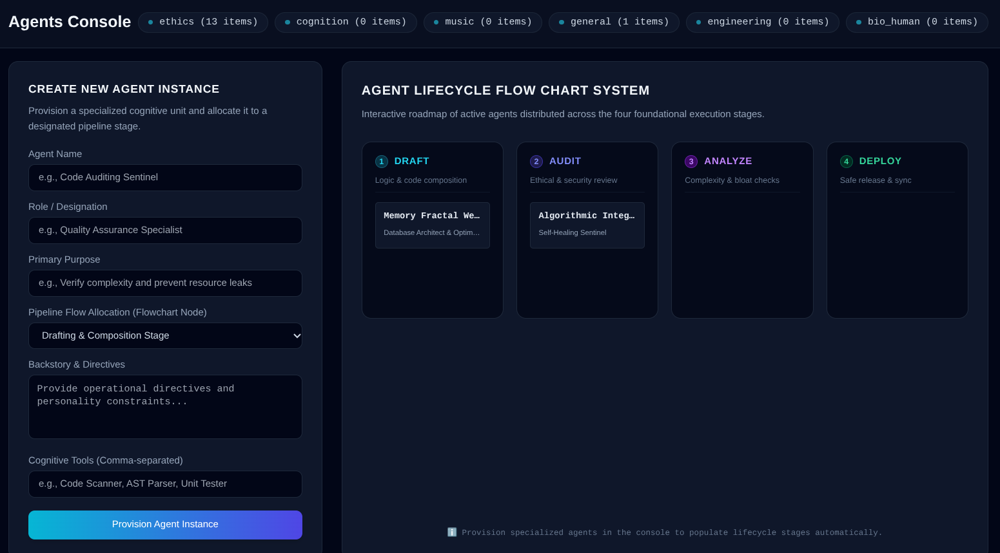
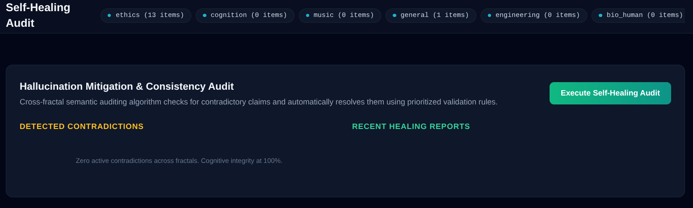
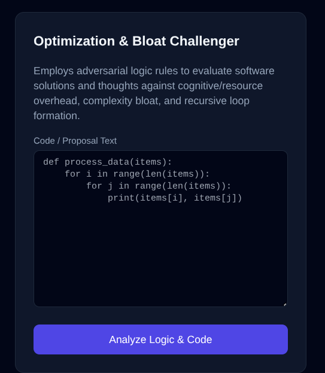
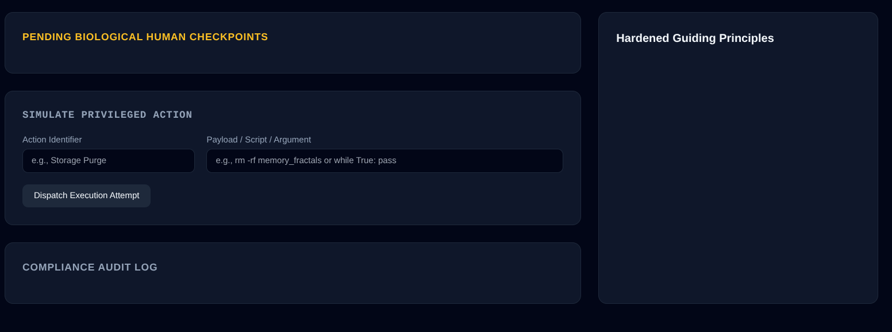
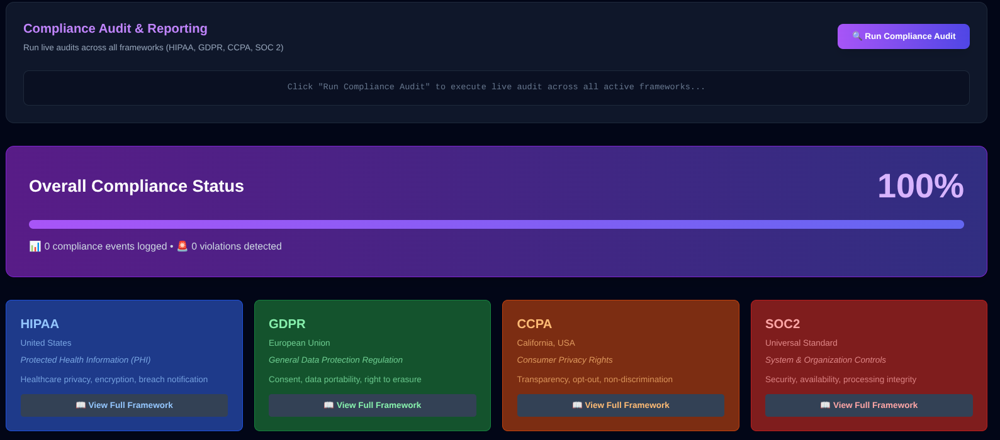

# 🧠 MeniscusMaximus

**A personal "digital brain" — a private, AI-assisted second mind for your knowledge, notes, and thinking.**

> 🔧 This is the **public preview** of MeniscusMaximus. The source code lives in a private repository while the project stabilizes. **A live, try-it-yourself demo is coming soon** — for now, here's what it does.

---

## What it is
MeniscusMaximus is a self-hosted web app that acts as a persistent, conversational "second brain." You talk to it, it remembers, and it helps you think — all running on infrastructure you control.

## Features
- 💬 **Conversational AI chat** over your own memories (retrieval-augmented, powered by Gemini)
- 🧩 **Persistent "fractal" memory** — your notes and knowledge, stored, indexed, and searchable
- 🔐 **Multi-factor security** — Master PIN, TOTP 2FA, and hardware security keys (WebAuthn / FIDO2)
- 👥 **Role-based access** — full Owner control plus a restricted "Newcomer" guest role
- ☁️ **Cloud backup** — real-time mirroring to Google Drive
- 🩺 **Self-healing & verification** — built-in consistency and hallucination checks
- 🎙️ **Voice dictation** — talk to your brain hands-free
- 🧭 **Guiding-principles framework** — keeps the assistant aligned to your values

## 📸 A look inside

**Conversational chat over your own memories**

**Capture knowledge into persistent "fractal" memory**

**Cognitive agent pipeline (Draft → Audit → Analyze → Deploy)**

**Self-healing & consistency auditing**

**Adversarial optimization & bloat checks**

**Human-in-the-loop checkpoints for privileged actions**

**Compliance & privacy dashboard**

## Status
Actively developed. The live demo is on the way — ⭐ **star the repo** to follow along.

## 💛 Support the project
I build this in the open and *not* for profit — if it resonates with you, support is hugely appreciated and entirely optional:
- ☕ [Ko-fi](https://ko-fi.com/subtiliorars)
- 🍵 [Buy Me a Coffee](https://buymeacoffee.com/subtilior.ars)
- 💳 [PayPal](https://paypal.me/DanielRead413)

*(You can also use the **♥ Sponsor** button at the top of this page.)*

---
*MeniscusMaximus is an independent project, built with care.*
